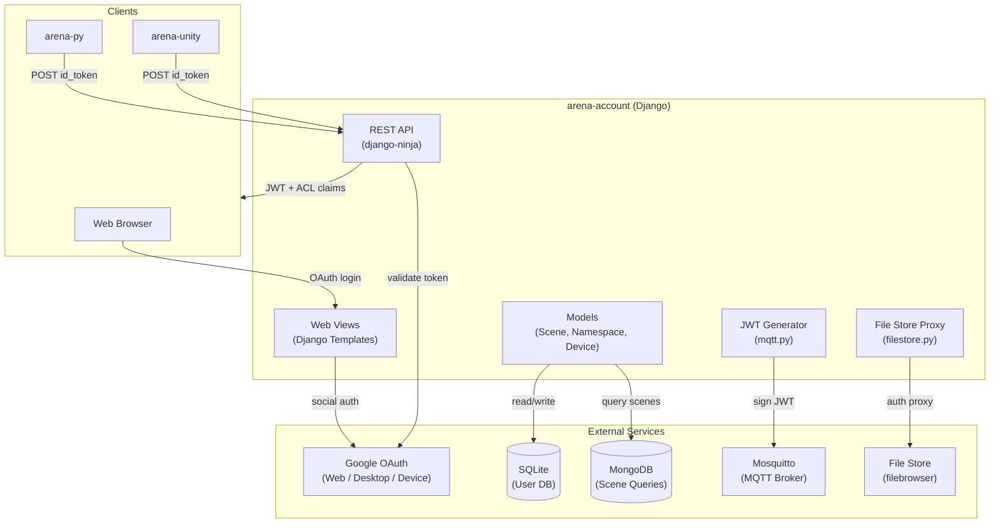
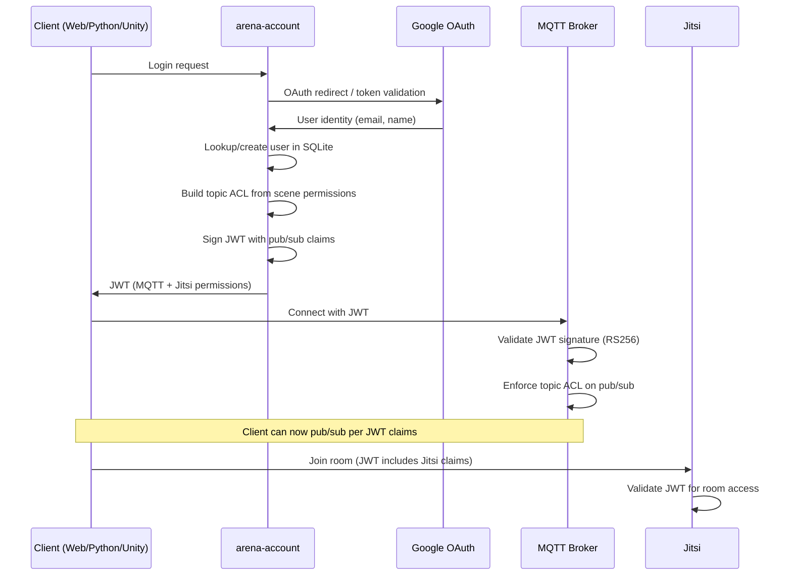

# ARENA Account — Requirements & Architecture

> **Purpose**: Machine- and human-readable reference for the ARENA authentication and access control service's features, architecture, and source layout.

## Architecture

## Source File Index

| File | Role | Key Symbols |
|------|------|-------------|
| [users/api.py](users/api.py) | REST API endpoints (django-ninja) | `user_state`, `mqtt_auth`, `health_state`, `storelogin`, `list_my_namespaces`, `list_my_scenes`, `scene_detail` |
| [users/views.py](users/views.py) | Web UI views (Django) | `index`, `login_request`, `logout_request`, `user_profile`, `scene_perm_detail`, `namespace_perm_detail`, `device_perm_detail`, `SocialSignupView` |
| [users/mqtt.py](users/mqtt.py) | JWT generation with topic ACL claims | JWT signing, pub/sub topic list generation |
| [users/models.py](users/models.py) | Database models | `Scene`, `Namespace`, `Device` permission models |
| [users/filestore.py](users/filestore.py) | File Store authentication proxy | store login, token management |
| [users/topics.py](users/topics.py) | MQTT topic pattern definitions | topic templates for ACL |
| [users/utils.py](users/utils.py) | Shared utilities | `scene_edit_permission`, `namespace_edit_permission`, `get_my_edit_scenes`, `get_user_from_id_token` |
| [users/schemas.py](users/schemas.py) | API request/response schemas | `MQTTAuthRequestSchema`, `SceneSchema` |
| [users/persistence.py](users/persistence.py) | Persistence DB queries | `read_persist_scene_objects` |
| [manage.py](manage.py) | Django management CLI | `createsuperuser`, `migrate`, `runserver` |

## Feature Requirements

### Authentication

| ID | Requirement | Source |
|----|-------------|--------|
| REQ-AC-001 | Google OAuth Web authentication (browser-based) | [users/views.py#login_request](users/views.py) |
| REQ-AC-002 | Google OAuth Desktop (installed) authentication for CLI apps | [users/api.py#user_state](users/api.py) |
| REQ-AC-003 | Google OAuth TV/Limited-Input Device flow for headless clients | [users/api.py#user_state](users/api.py) |
| REQ-AC-004 | Anonymous login with restricted permissions | [users/api.py#mqtt_auth](users/api.py) |
| REQ-AC-005 | Social signup with username registration | [users/views.py#SocialSignupView](users/views.py) |

### JWT & Access Control

| ID | Requirement | Source |
|----|-------------|--------|
| REQ-AC-010 | JWT issuance with per-topic pub/sub ACL claims | [users/mqtt.py](users/mqtt.py), [users/api.py#mqtt_auth](users/api.py) |
| REQ-AC-011 | Scene permissions: `public_read`, `public_write`, `allow_anonymous`, editors list | [users/models.py](users/models.py) |
| REQ-AC-012 | Namespace ownership (user-scoped scene namespaces) | [users/models.py](users/models.py) |
| REQ-AC-013 | Staff/admin elevated permissions (all-scene access) | [users/views.py#profile_update_staff](users/views.py) |
| REQ-AC-014 | Session-based user IDs (`camera_{session-id}_{username}`) to prevent spoofing | [users/api.py#mqtt_auth](users/api.py) |
| REQ-AC-015 | Device permissions management | [users/views.py#device_perm_detail](users/views.py) |

### REST API

| ID | Requirement | Source |
|----|-------------|--------|
| REQ-AC-020 | `GET/POST /user/user_state` — authenticated status, username, email | [users/api.py#user_state](users/api.py) |
| REQ-AC-021 | `POST /user/mqtt_auth` — request JWT with MQTT + Jitsi permissions | [users/api.py#mqtt_auth](users/api.py) |
| REQ-AC-022 | `GET /user/health` — system health (SQLite, MongoDB, File Store status) | [users/api.py#health_state](users/api.py) |
| REQ-AC-023 | `GET/POST /user/storelogin` — File Store authentication token | [users/api.py#storelogin](users/api.py) |
| REQ-AC-024 | `GET/POST /user/my_namespaces` — list editable/viewable namespaces | [users/api.py#list_my_namespaces](users/api.py) |
| REQ-AC-025 | `GET/POST /user/my_scenes` — list editable/viewable scenes | [users/api.py#list_my_scenes](users/api.py) |
| REQ-AC-026 | `GET/POST/PUT/DELETE /user/scene/:name` — scene CRUD and permissions | [users/api.py#scene_detail](users/api.py) |
| REQ-AC-027 | Versioned API (v1, v2) with OpenAPI documentation | [users/versioning.py](users/versioning.py) |

### Web UI

| ID | Requirement | Source |
|----|-------------|--------|
| REQ-AC-030 | Login page with Google OAuth and anonymous options | [users/views.py#login_request](users/views.py) |
| REQ-AC-031 | User profile page (scenes, namespaces, devices, account delete) | [users/views.py#user_profile](users/views.py) |
| REQ-AC-032 | Scene permission editor (public_read, public_write, editors) | [users/views.py#scene_perm_detail](users/views.py) |
| REQ-AC-033 | Namespace permission editor | [users/views.py#namespace_perm_detail](users/views.py) |
| REQ-AC-034 | User autocomplete for editor assignment | [users/views.py#UserAutocomplete](users/views.py) |

## Auth Flow

## Planned / Future

- Additional OAuth providers beyond Google
- Fine-grained per-object access control
- API key support for service-to-service auth
